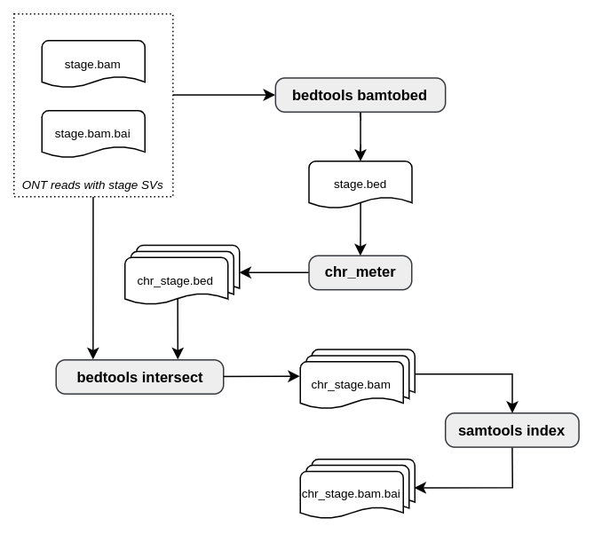

# bam-splitter: chromosome splitting for whole genome BAM files of human genomes

## Introduction

bam-splitter is a **[Snakemake](https://snakemake.readthedocs.io/en/stable/) 
workflow** for chromosomal splitting of whole-genome BAM files. It was created 
to complement **[visor-simulations](https://github.com/villena-francis/visor-simulations)**,
which generates whole-genome BAM files on an HPC cluster that cannot execute 
graphical interfaces. This requires generating smaller files that can be 
efficiently processed on a local machine, allowing for the assessment of read 
simulation quality through visualization in a genome browser for my **[master's thesis
in bioinformatics](https://github.com/my/master/thesis)**.

## Worflow overview

This is a simplified diagram of the workflow steps:

<p align="center">
  
</p>

## Usage

### 1. Download bam-splitter from GitHub

Use the git clone command to create a local copy of the repository. Ensure you 
place it in a location that allows you to work with the data generated by 
visor-simulations.

```shell
git clone https://github.com/villena-francis/bam-splitter
```

### 2. Set up the configuration file

In the `config/config.yaml` file, you should specify the input directory 
(`path/to/visor-simulations/results`), the identifiers for the output 
directories generated by VISOR-LASeR that contain the whole-genome BAM files 
(`{stage}_{coverage}x_{replicate}`), and the chromosomes for which you want to 
generate individual copies (e.g., chr1, chr6, chr9...).

> The way chromosomes are designated may vary depending on the annotation style 
> of the reference genome used for simulating long reads. This setup is 
> compatible with the [**reference genome example provided in visor-simulations**](https://github.com/villena-francis/visor-simulations?tab=readme-ov-file#reference-genome).

### 3. Run the workflow

To execute the workflow, navigate to the `bam-splitter` directory. It is assumed 
that you have previously used the visor-simulations workflow, so you should be 
able to reuse the Conda environment [**snakemake_visor**](https://github.com/villena-francis/visor-simulations?tab=readme-ov-file#2-set-up-the-environment) 
to run the Snakemake command with the arguments specified below. The first time 
you run the workflow, it will take a few minutes to set up the Conda 
dependencies.

```shell
# Navigate to the bam-splitter directory
cd /path/to/bam-splitter
# Activate the environment
conda activate snakemake_visor
# Run the workflow (example with the Slurm workload manager)
snakemake --use-conda -j unlimited --executor slurm
```

## Workflow steps

Here you will find a comprehensive overview of the Snakemake rules that 
constitute the workflow.

### 1. bamtobed

This step uses the bamtobed utility from Bedtools to create BED files from 
whole-genome BAM files, specifically for cases where subsamples by chromosome 
are needed. The output file from this process is saved in the bam-splitter 
directory as `resources/{stage}_{coverage}x_{replicate}.bed`

### 2. chr_meter

A custom script processes the file generated by the bamtobed rule and annotates 
individual BED files for the chromosomes specified in the configuration file, 
including chromosome name, start position, and end position. The output files 
from this step are saved as 
`results/{stage}_{coverage}x_{replicate}/{chr}_{stage}_{coverage}x_{replicate}.bed`.

### 3. intersect

This rule employs the intersect utility from Bedtools to extract individual 
copies of the specified chromosomes from whole-genome BAM files, using the BED 
instructions generated by the chr_meter rule. The output files from this step 
are saved as 
`results/{stage}_{coverage}x_{replicate}/{chr}_{stage}_{coverage}x_{replicate}.bam`.

### 4. index

Finally, Samtools is used to generate an index for each BAM file produced by 
the intersect rule. The output files from this step are saved as 
`results/{stage}_{coverage}x_{replicate}/{chr}_{stage}_{coverage}x_{replicate}.bam.bai`.

## Aditional: visual inspection of chromosomal BEDs

In my master's thesis, the inspection of chromosomal BEDs was performed using 
[**Genome-Wide (GW)**](https://github.com/kcleal/gw), a novel ultra-fast and 
interactive genome browser. GW enables the exploration of extensive genomic 
regions and entire chromosomes, incorporating specialized features like manual 
curation facilitated by information extracted from input VCF files. This 
functionality was utilized to quickly review the hits detected by the SV 
callers.